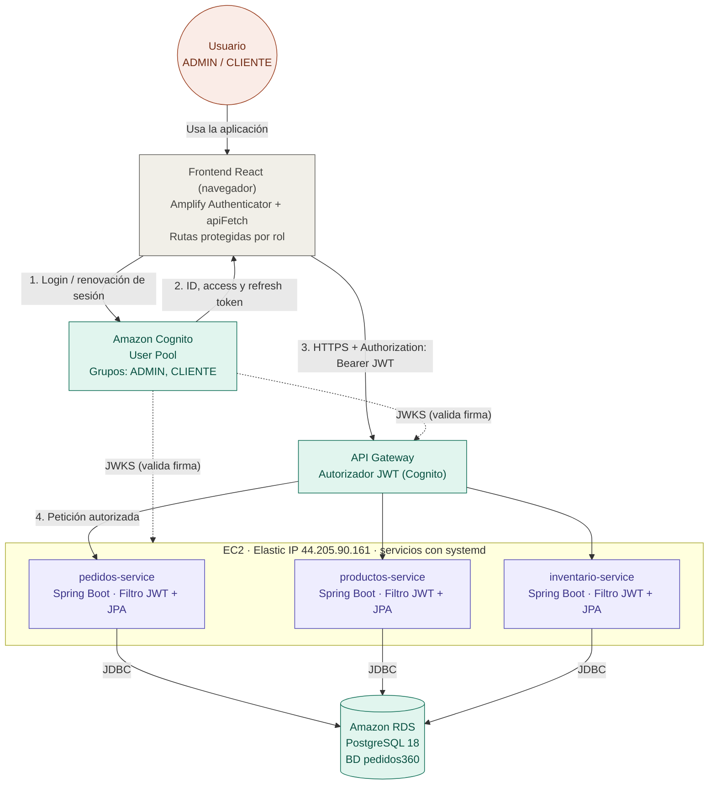

# Pedidos360 - Frontend

Frontend web de la plataforma **Pedidos360**, desarrollado con React y TypeScript.

Este proyecto corresponde a la interfaz utilizada para consultar el catálogo de zapatillas y posteriormente gestionar los pedidos de los clientes.

## Tecnologías utilizadas

- React
- TypeScript
- Vite
- AWS Amplify
- Amazon Cognito

## Ejecución local

Para instalar las dependencias:

```bash
npm install
```


